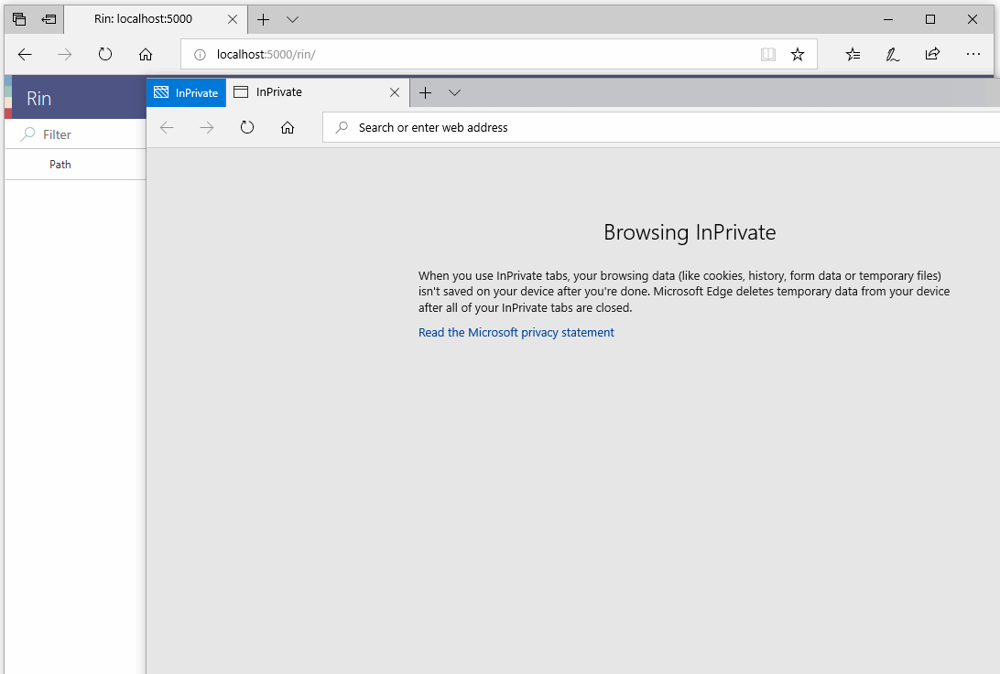
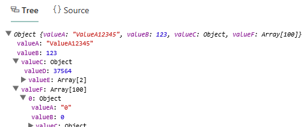
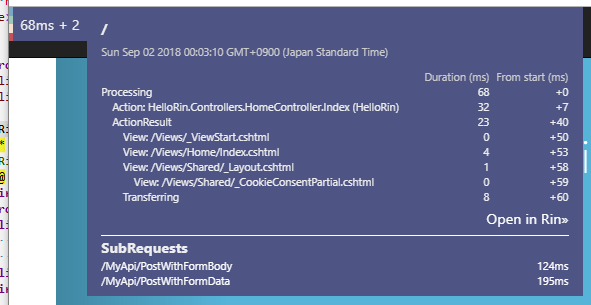

#  Rin
**R**equest/response **In**spector middleware for ASP.NET Core. like Glimpse.

Rin captures HTTP requests to ASP.NET Core app and provides viewer for captured data. It's useful tool to debug your Web application.



# Features
## 📼 Record incoming requests and responses (+additional metrics)
- Traces (`Microsoft.Extensions.Logging.ILogger`, log4net, ...)
- Unhandled Exception

## 🌎 Inspect from Web browser

### ⚡ Stream requests in realtime (powered by WebSocket)

### ⏲ View events timeline


### 🔍 Preview a request/response body
- JSON as tree view
- Image preview (PNG, JPEG, SVG, ...)
- Syntax highligting (powered by Monaco Editor)
- application/x-www-form-urlencoded as list view



### 📝 View related trace logs
- Built-in `Microsoft.Extensions.Logging.ILogger` integration
- log4net Appender

### 💾 Save and export request/response
- Save request/response body
- Copy request as cURL and C#

### 🔌 Integrate with ASP.NET Core MVC
- Record timings of view rendering and action execution
- In-View Inspector (like MiniProfiler)



# Requirements
- .NET Core 2.0+
- ASP.NET Core 2.1+
- ASP.NET Core MVC 2.1+
- Modern browser (e.g. Microsoft Edge, Google Chrome, Firefox, Safari...)
    - WebSocket connectivity

# QuickStart

## Install NuGet Package
### Using Visual Studio
`Dependencies` -> `Manage NuGet Packages...` -> Search and install `Rin` and `Rin.Mvc` (if your project is built with ASP.NET MVC Core) package.

### Using dotnet command
```
dotnet add package Rin
dotnet add package Rin.Mvc
```

### Using Package Manager
```
Install-Package Rin
Install-Package Rin.Mvc
```

## Setup and configure Rin

### Program.cs
```csharp
public static IWebHostBuilder CreateWebHostBuilder(string[] args) =>
    WebHost.CreateDefaultBuilder(args)
        .ConfigureLogging(configure =>
        {
            // Add: Enable Rin Logger
            configure.UseRinLogger();
        })
        .UseStartup<Startup>();
```

### Startup.cs

```csharp
public class Startup
{
    ...
    public void ConfigureServices(IServiceCollection services)
    {
        ...
        
        services.AddMvc().SetCompatibilityVersion(CompatibilityVersion.Version_2_1);

        // Add: Register Rin services
        services.AddRin();
    }
    ...
    public void Configure(IApplicationBuilder app, IHostingEnvironment env)
    {
        if (env.IsDevelopment())
        {
            // Add: Enable request/response recording and serve a inspector frontend.
            // Important: `UseRin` (Middlewares) must be top of the HTTP pipeline.
            app.UseRin();

            // Add(option): Enable ASP.NET MVC Core support if the project built with ASP.NET MVC Core
            app.UseRinMvcSupport();

            app.UseDeveloperExceptionPage();

            // Add: Enable Exception recorder. this handler must be after `UseDeveloperExceptionPage`.
            app.UseRinDiagnosticsHandler();
        }
        ...
    }
}
```

### _Layout.cshtml (for ASP.NET Core MVC)
```cshtml
@inject Rin.Mvc.View.RinHelperService RinHelper
...
    <environment include="Development">
        <link rel="stylesheet" href="~/lib/bootstrap/dist/css/bootstrap.css" />
        <link rel="stylesheet" href="~/css/site.css" />
        @* Add: Enable In-View Inspector for ASP.NET MVC Core *@
        @RinHelper.RenderInViewInspector()
    </environment>
...
```

## Start the application and open Inspector on the web

Launch the app, then open `http://[Host:Port]/rin/` in the browser, you can see Rin Inspector now.

# Develop and build Rin Inspector (frontend)
The front-end codes for Rin is separated from Rin core C# project. If you want to develop Rin or launch a sample project, you need to build and pack the codes.

## Setup and start the development server
- `npm install`
- `npm run start`

## Build Rin/Resources.zip
- `npm run build`
- `npm run pack`

# License
[MIT License](LICENSE)